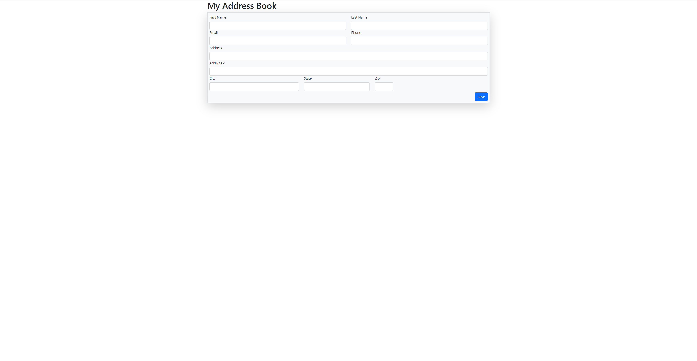
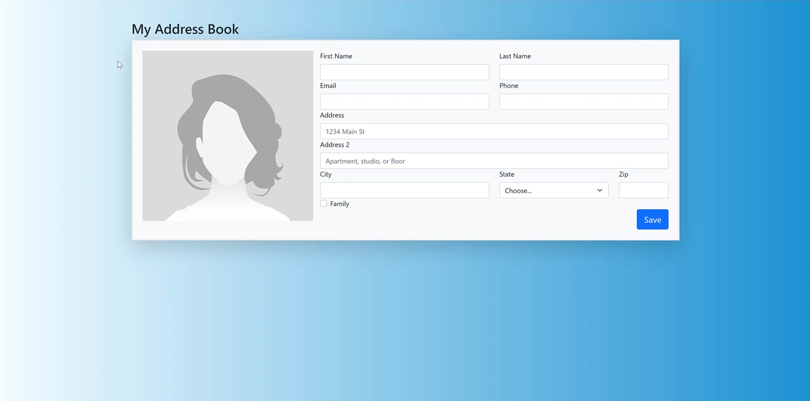

# CF-05.BootStrapContactFormProject

## *Address book project using bootstrap, HTML5, and CSS*<hr>

## Technologies Used:
- Shell and scripting language: Powershell
- Frontend: HTML5, CSS, Bootstrap
<hr>

## Challenges
- Using resources I've learned to attempt to clone a contact form from scratch
- initializing HTML and CSS files
<hr>

## Attempt vs. Solution

<hr>

## Solution

- Add the bscf-template-base
- Link CSS style sheet
- remove the body text
- Copy CSS code form uiGradient
- Navigate to CSS style sheet and create a body tag (do not put a period before it) and paste the CSS
- THE HTML PAGE WILL BE BLANK UNTIL YOU ADD CONTENT. You can add a height class to html tag and body tag to generate the background.
- Add the h1 title as well as a top margin of 5 (mt-5)
- Add a class to the header (didn't know you could do this) that centers the text and chooses the light color
- Create a new div, this will be the container for our form, and give it the following class: border border-2 border-info shadow-lg p-2 bg-light
- add our form and give it a blank action
- looking at the contact form solution, we see two columns so add a row div and two col div's
- Perform the scaffolding to make sure the divs are properly nested
  ```
  
                   <div class="row">            --->    <div class="row">
                       <div class="col"></div>  --->        <div class="col">
                       <div class="col"></div>  --->        
                   </div>                       --->        </div>
                                                --->        <div calss="col">
                                                --->
                                                --->        </div>
                                                --->    </div>                    
  ```
- Give the first column a label tag with a class of form-label and name our label First Name
- create an input tag, this is for the user to enter their information, give a type of text, a name of "firstName"(notice the Capitalization, this is for C# purposes), a class of form-control, a placeholder of First Name, an aria-label of First Name, and give it the required element
- copy and paste the first row and rename the columns email and phone optional, email will have the name "email" and phone will NOT be a required field
- Add another row with a single column, this will be the Subject field
- for the message field, create a row with a single column, and give it a label tag with the class of form label, next give it a text area tag with the following: type="text" name"message" clsass="form control" placeholder="Message" aria-label="Message" and make it required. Text area will have a closing tag
- on the outside of the message container, create a button with a type of submit and a class of btn btn-primary mt-2, label the button submit
## Table of Contents <hr>

## Credits
### Project References
  
- <a href="https://uigradients.com/">uiGradients</a>
- <a href="https://github.com/adam-p/markdown-here/wiki/Markdown-Cheatsheet">Bootstrap Docs</a>
  
<hr>

## License
<hr>
